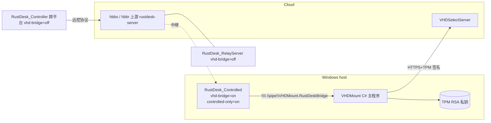
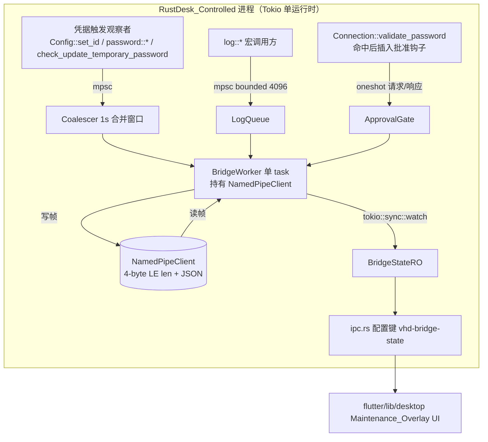
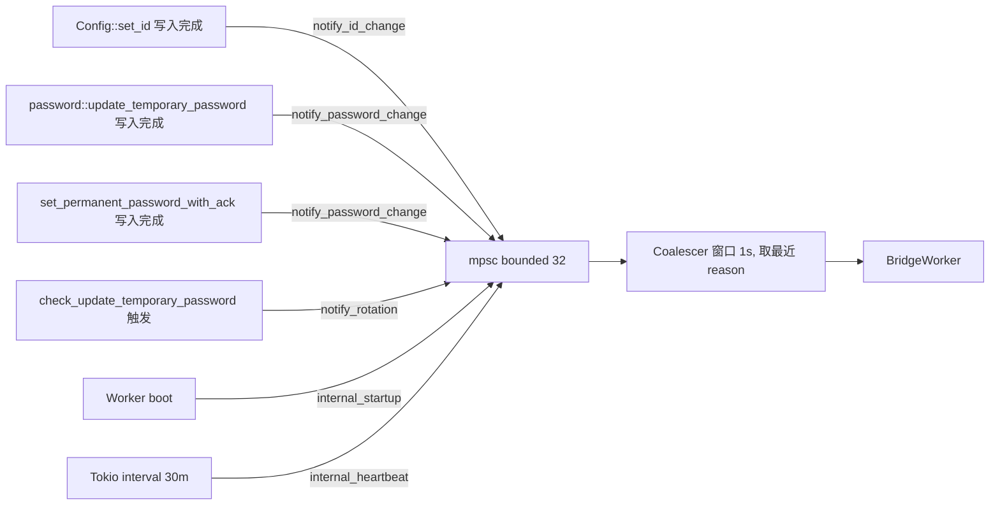
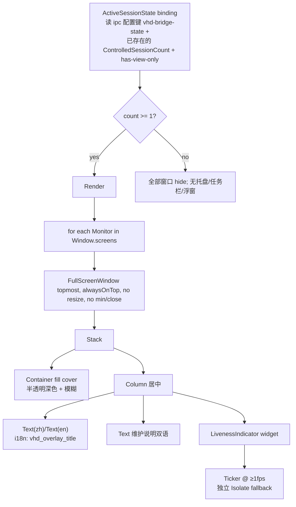
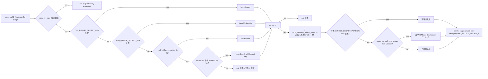
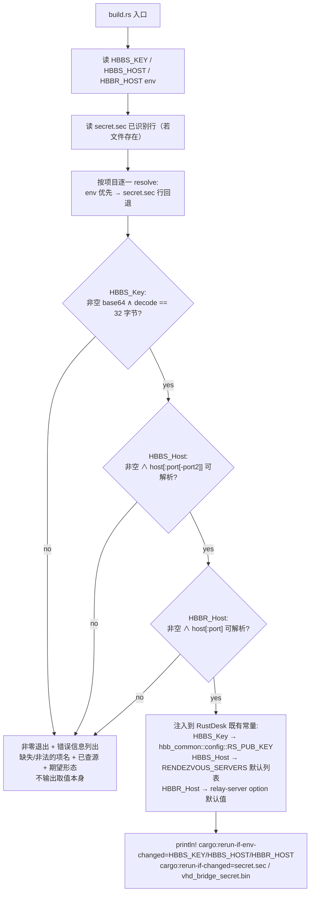

# Design Document

## Overview

`vhd-machine-auth-bridge` 在 `RustDesk_Controlled`（Windows-only 被控端）进程内嵌入一个轻量、单连接的本机命名管道客户端，把远控 ID / 登录密码、被控端日志、主控端身份批准请求定向投递给同机的 C# 主程序 `VHDMount`。RustDesk 一侧不再承担 TPM 私钥访问、HTTPS 证书加载、`VHDSelectServer` URL 选择与重试等任何远端逻辑——这些全部由 `VHDMount` 完成。

本设计落实需求文档中的三条主轴：

1. **三种部署形态严格分离**：仅 `RustDesk_Controlled`（Windows）链接桥接代码、`Maintenance_Overlay` 与 `RustDeskClientSharedSecret`；`RustDesk_Controller` 与 `RustDesk_RelayServer` 形态产物绝不携带任何与桥接相关的字符串字面量、HMAC 输入或共享密钥（Requirement 1 / 14）。
2. **桥接是观察者，不是门控**：`Bridge_State` 仅作为可观测性信号驱动 UI 与诊断；远控接受策略由 RustDesk 既有 `validate_password` 一票通过，再叠加 `Peer_Approval_Request` 二次批准，命名管道不可用时退回"密码正确即放行"兜底（Requirement 8 / 19）。
3. **协议固化为四种帧**：`VHDRustDeskBridgeHandshakeV1` / `VHDRustDeskBridgeReportV1` / `VHDRustDeskBridgeLogV1` / `VHDRustDeskBridgePeerApprovalV1`，全部使用"4 字节小端长度前缀 + JSON 负载"，HMAC-SHA256(`RustDeskClientSharedSecret`, ...) 作为完整性证明。该协议另外以 `docs/vhd-rustdesk-bridge-protocol.md` 形式独立交付（Requirement 16）。

设计目标排序：

- **正确性**：HMAC 输入字符串与字段顺序在客户端、服务端、规范文档三处必须字节级一致；`subtle::ConstantTimeEq` 校验对端 MAC；nonce 在 5 分钟窗口内不重用；密码相关缓冲区用完即清零。
- **最小侵入**：桥接代码集中在新建子目录 `src/vhd_bridge/`；只在 `Config::set_id` / `password::update_temporary_password` / `set_permanent_password_with_ack` / `check_update_temporary_password` / `Connection::validate_password → try_start_cm` 处以"观察者 + 批准钩子"形式接入。
- **生产可恢复性**：本机 IPC，重连只用固定 2000 ms + 0–200 ms 抖动；`rate_limited` 在该间隔之上叠加 60 s；不引入指数退避；`BrokenPipe`/`ConnectionReset` 永远走 `Initializing`，不会自己升到 `Failed`。
- **不污染产物**：共享密钥在 `build.rs` 编译期注入，缺失即非零退出；运行期任何配置同步消息、日志、崩溃转储都不能携带密钥本体或派生值；`Bridge_Config.secret_version` 是日志中允许出现的唯一与共享密钥相关的字段。

## Architecture

### 部署形态分布



要点：

- `RustDesk_Controlled` 与 `VHDMount` 同机；它们之间的唯一通道是 `\\.\pipe\VHDMount.RustDeskBridge` 命名管道。
- `VHDSelectServer` 与 `Controlled` 没有任何直接通道；上报全部经 `VHDMount` 代签 + 转发。
- `Controller` / `RelayServer` 形态产物里 `cfg(feature = "vhd-bridge")` 为 false，本特性所有代码、字符串字面量、依赖均被条件编译剔除。

### 进程内任务图



要点：

- 整个桥接由**单个** `BridgeWorker` task 拥有命名管道句柄，所有写入都串行化；不需要在管道句柄上加锁。
- 触发观察者只通过 `tokio::sync::mpsc` 发事件；不在调用方线程执行 HMAC 或 IPC I/O（Requirement 7.9 / 18.4）。
- 状态对外只读，通过 `tokio::sync::watch::Sender<BridgeStateSnapshot>` 暴露，避免读路径持有锁（兼容 AGENTS.md "不在 `.await` 上持锁"）。

### 状态机

```mermaid
stateDiagram-v2
    [*] --> Disabled: feature off (compile-time)
    [*] --> Initializing: startup, feature on
    Initializing --> Connected: handshake ok
    Initializing --> Initializing: connect fail / timeout 重试
    Initializing --> Denied: HandshakeResponse{deny|rate_limited|invalid_proof}
    Initializing --> Failed: secret_outdated / pipe peer mismatch / 永久型版本不匹配
    Connected --> Authorized: first ReportAck{accepted}
    Connected --> Initializing: BrokenPipe / ConnectionReset / EOF
    Connected --> Denied: ReportAck{rejected, deny|rate_limited}
    Connected --> Failed: ReportAck{rejected, secret_outdated}
    Authorized --> Initializing: BrokenPipe / ConnectionReset / EOF
    Authorized --> Denied: ReportAck{rejected, deny|rate_limited}
    Authorized --> Failed: ReportAck{rejected, secret_outdated}
    Denied --> Initializing: 固定间隔 (+ 60s if rate_limited) 后重新握手
    Failed --> Initializing: secret_version 变更 / 进程重启 / vhd_bridge::reset()
    Disabled --> [*]
```

`Disabled` 仅由编译特性关闭这一构建期事实触发；**运行期永远不会从其它状态回到 `Disabled`**（Requirement 4.6 / 8.1）。

### 与 RustDesk 既有体系的边界

| 既有模块 | 本特性接入方式 | 修改幅度 |
| --- | --- | --- |
| `libs/hbb_common/src/config.rs` | 新增 `Bridge_Config` 4 字段 + `vhd-bridge-state` 只读 IPC 键 | 仅追加 |
| `libs/hbb_common/Cargo.toml` | 启用现有 `hmac` / `sha2` / `rand`；新增可选 `subtle = "2"` 与 `zeroize = "1"`，仅 `feature = "vhd-bridge"` 时编译 | 加 2 个轻量 crate |
| `src/ipc.rs` | 新增 `Data::VhdBridgeState(BridgeStateSnapshot)` 变体 + `vhd-bridge-state` 配置键消费分支 | 仅追加 |
| `src/custom_server.rs` | **不修改**；仅声明兼容性 | 0 行 |
| `src/server/connection.rs` | 在 `validate_password() → true` 之后、`try_start_cm(.., authorized=true)` 之前插入 `vhd_bridge::peer_approval::gate(&lr).await`；裁剪发起方代码用 `cfg(feature = "controlled-only")` 包住既有路径 | 局部钩子 |
| `src/ui_interface.rs` / `password.rs` / `Config::set_id` 调用点 | 在已有写入完成后调用 `vhd_bridge::triggers::notify(...)` | 每处 +1 行 |
| `src/lan.rs` | 主动发现 `discover()` 用 `cfg(not(feature = "controlled-only"))` 包住；被动应答 `start_listening` 保留（Requirement 20.5a） | 仅条件编译 |
| `src/main.rs` / `src/core_main.rs` CLI | `--connect` / `--play` / `--port-forward` / `--file-transfer` / `--rdp` / `--view-camera` / `--terminal` 在 `controlled-only` 下立即非零退出并通过 §18 路径记录拒绝原因 | 局部 cfg |
| `flutter/lib/desktop/` | 新增 `widgets/maintenance_overlay.dart` + 路由 | 新文件 |
| `build.rs` | 新增 `feature = "vhd-bridge"` 条件分支：解析共享密钥、生成 `vhd_bridge_secret.rs` 给 `include!()` | 仅追加 |

### 编译特性矩阵

| Cargo feature | `RustDesk_Controlled` | `RustDesk_Controller` | `RustDesk_RelayServer` |
| --- | --- | --- | --- |
| `vhd-bridge` | **on**（默认） | off | off |
| `controlled-only` | **on**（默认） | off | off |
| `flutter` | on | on | off |

`controlled-only` 单独存在是因为 §20 的发起方裁剪需要在 `vhd-bridge` 关闭的研发分支下也能独立验证；二者默认在 `RustDesk_Controlled` 形态同时启用，但解耦使 §1.7 的"特性关闭等价于未集成"成为机械可验证事实。

## Components and Interfaces

新增 Rust 模块全部位于 `src/vhd_bridge/`：

```
src/vhd_bridge/
├── mod.rs              // 模块入口，re-export 公共 API；非 Windows 时空 stub
├── config.rs           // Bridge_Config 字段 + 默认值 + 校验
├── secret.rs           // RustDeskClientSharedSecret 访问 + zeroize 工具
├── frame.rs            // 4-byte LE 长度前缀编解码 + frame size guard
├── protocol.rs         // 四种 JSON 帧 struct + serde derive
├── hmac.rs             // HMAC 输入构造 + 恒定时间比较
├── pipe.rs             // NamedPipeClient 连接 + GetNamedPipeServerProcessId 校验
├── worker.rs           // BridgeWorker 状态机 task
├── triggers.rs         // mpsc<TriggerEvent> + Coalescer
├── log_sink.rs         // log::Log 实现 + bounded mpsc + 丢弃计数
├── peer_approval.rs    // gate(&lr) 钩子 + ttl 缓存
├── observability.rs    // current_state() + IPC vhd-bridge-state 同步
└── tests/              // 单元 + 属性测试（见 Testing Strategy）
```

非 Windows 形态下整个 `mod vhd_bridge` 用 `#[cfg(all(target_os = "windows", feature = "vhd-bridge"))]` 包住；其它形态调用方使用一组 `#[cfg]` 守卫的 no-op 替身吸收，避免 `cfg!` 散落在调用方。

### 公共 API

只暴露下列符号，全部位于 `vhd_bridge::`：

```rust
// 仅在 cfg(all(windows, feature = "vhd-bridge")) 下定义；其它形态返回常量值。
pub fn start(rt: &tokio::runtime::Handle);                       // 进程入口由 core_main 调用一次
pub fn current_state() -> BridgeStateSnapshot;                    // §12.1 只读 API
pub fn reset();                                                   // §11.4 用户触发"重置桥接"
pub fn install_log_sink();                                        // §18 接管 log 全局 logger

pub mod triggers {
    pub fn notify_id_change();
    pub fn notify_password_change();
    pub fn notify_rotation();
}

pub mod peer_approval {
    pub async fn gate(lr: &LoginRequest, peer_addr: SocketAddr, conn_type: ConnectionType)
        -> ApprovalOutcome;
}

#[derive(Clone)]
pub struct BridgeStateSnapshot {
    pub state: BridgeState,
    pub last_reason: Option<&'static str>,
    pub secret_version: u32,
    pub log_drop_count: u64,
    pub last_change_at_ms: u64,
}

pub enum ApprovalOutcome {
    Approved,
    Rejected,
    BridgeUnavailable,   // §19.8 兜底：调用方继续走密码-即放行
}
```

`current_state()` 实现读取 `tokio::sync::watch::Receiver`（也能 `.borrow()` 同步读取），不再加 `Mutex<BridgeState>`，遵守 AGENTS.md "不要在 `.await` 上持锁"。

### Bridge_Config

```rust
// libs/hbb_common/src/config.rs（仅 cfg(all(windows, feature = "vhd-bridge")) 下定义）
pub struct BridgeConfig {
    pub pipe_name: String,           // 默认 "\\\\.\\pipe\\VHDMount.RustDeskBridge"
    pub secret_version: u32,         // 默认值由编译期 §3.6 决定
    pub request_timeout_ms: u32,     // 默认 5000
    pub retry_interval_ms: u32,      // 默认 2000
}
```

要点：

- **没有 `enabled` 字段**（Requirement 4.2）。
- 字段通过 `libs/hbb_common/src/config.rs` 既有 `keys` 机制暴露，可被 IPC 同步、CLI 覆盖；任何把 `enabled` 注入这一组键的请求被 `pub(crate) fn try_apply_bridge_option(name, value)` 显式拒绝并 `log::warn!`（Requirement 4.5）。
- 空字符串 / 解析失败的 `pipe_name` 由 `BridgeConfig::resolve_pipe_name(&self) -> Cow<'_, str>` 在使用点回退到默认值，仅 `warn`，不进入 `Disabled` / `Failed`（Requirement 4.4）。

### BridgeWorker 控制流

```mermaid
sequenceDiagram
    participant TR as Triggers (Coalescer)
    participant LG as LogQueue
    participant AP as ApprovalGate
    participant W as BridgeWorker
    participant P as VHDMount(named pipe)

    Note over W: state = Initializing
    loop reconnect
        W->>P: ClientOptions::open(pipe_name) [timeout=request_timeout_ms]
        P-->>W: NamedPipeClient
        W->>W: GetNamedPipeServerProcessId + 进程映像路径校验
        W->>P: write_frame(Handshake_Frame)
        P-->>W: read_frame(HandshakeResponse)
        alt ok
            W->>W: state = Connected; emit Trigger(startup)
        else rate_limited|deny|invalid_proof
            W->>W: state = Denied; sleep(retry + 60s if rate_limited)
        else secret_outdated
            W->>W: state = Failed; break loop forever
        else timeout / pipe peer mismatch
            W->>W: close + state = Initializing/Failed; sleep(retry + jitter)
        end
    end
    par event loop while Connected/Authorized
        TR->>W: TriggerEvent(reason)
        W->>W: 若与 Last_Reported_Snapshot 相同 且 reason != heartbeat ⇒ skip
        W->>P: write_frame(Report_Frame)
        P-->>W: ReportAck
        W->>W: state = Authorized (first accepted); cache snapshot
    and
        LG->>W: LogEvent
        W->>P: write_frame(Log_Frame)
    and
        AP->>W: PeerApprovalRequest(controllerId, ...) [oneshot]
        W->>P: write_frame(Peer_Approval_Request)
        P-->>W: Peer_Approval_Response
        W->>AP: ApprovalOutcome
    and
        timer 30min
        W->>W: TriggerEvent(heartbeat)
    end
```

写入串行化由 worker 自己驱动；读路径用 `tokio::select!` 等待多路事件源（`mpsc` + 管道 read half）。所有 `await` 点都不持锁。

### 触发器调度（Triggers / Coalescer）



合并规则（Requirement 7.8）：

- 窗口长度：1 秒。
- 优先级（窗口内出现多个 reason 时取右值）：`heartbeat < startup < id_change ≈ password_change ≈ rotation`。`heartbeat` 与任意其它 reason 共存时丢 `heartbeat`，否则取**最后到达**的 reason，使最新事件语义胜出。
- 队列满时（buffer = 32）丢**最旧**的 trigger 并 `warn`；rotation/id_change/password_change 的合并队列里只保留最新值。
- 心跳定时器始终运行（Requirement 7.7），到点即投递 `internal_heartbeat`，由 worker 在写入瞬间根据 `Bridge_State` 决定真发送或跳过。

### 上报去重

`Last_Reported_Snapshot = (rustDeskId, passwordKind, sha256Hex(password))`。Worker 每次 `ReportAck.accepted` 后写入；下一次触发到达时：

```rust
if reason != "heartbeat"
    && next_snapshot == last_reported_snapshot
    && state == Authorized
{
    log::debug!("vhd_bridge: dedup skip");
    continue;
}
```

`heartbeat` 永远发送，用于对账。

### 命名管道层（pipe.rs）

```rust
async fn open_and_verify(pipe_name: &str, timeout_ms: u32)
    -> Result<NamedPipeClient, ConnectError>;
```

实现要点：

1. `tokio::time::timeout(Duration::from_millis(timeout_ms), ClientOptions::new().open(pipe_name))` 限制连接耗时；`Err` 走 §9.1 重试。
2. 连接成功后立刻 `GetNamedPipeServerProcessId` 拿对端 PID，再用 `windows::Win32::System::Threading::QueryFullProcessImageNameW` 拿映像路径，校验文件名为 `VHDMount.exe`；可选 Authenticode 签名链校验作为后续增强。
3. 校验失败立即 `shutdown()` 并返回 `ConnectError::PeerNotVhdMount`，由 worker 翻译成永久型错误 → `Failed`（Requirement 10.5）。
4. **不在没有打开管道的代码路径上做对端校验**——把校验耦合到连接生命周期上，避免 `current_state()` 等只读 API 触发额外 syscall。

### 帧编解码（frame.rs）

与 `src/ipc.rs` 一致采用"4 字节小端长度前缀 + 负载"。差异是负载格式固定 JSON，帧大小硬上限 `MAX_FRAME_BYTES = 64 KiB`：

```rust
const MAX_FRAME_BYTES: usize = 64 * 1024;

pub async fn read_frame<R: AsyncRead + Unpin>(r: &mut R, scratch: &mut Vec<u8>)
    -> io::Result<&[u8]>;
pub async fn write_frame<W: AsyncWrite + Unpin>(w: &mut W, payload: &[u8])
    -> io::Result<()>;
```

`read_frame` 在长度字段超过 `MAX_FRAME_BYTES` 时返回 `io::Error::new(InvalidData, ...)`，由 worker 翻译成"会话毁坏 → `Initializing`"。

### HMAC 与共享密钥

`secret.rs` 暴露：

```rust
// 由 build.rs 生成 vhd_bridge_secret.rs，include!() 进来。
pub(super) const SHARED_SECRET: [u8; 32] =
    include!(concat!(env!("OUT_DIR"), "/vhd_bridge_secret.rs"));
pub(super) const SHARED_SECRET_VERSION: u32 = /* env VHD_BRIDGE_SECRET_VERSION */;

pub(super) fn with_shared_secret<R>(f: impl FnOnce(&[u8; 32]) -> R) -> R {
    // 仅在 HMAC 计算函数内部以最小作用域读取密钥
    f(&SHARED_SECRET)
}
```

`hmac.rs` 提供构造 HMAC 输入的 builder（per protocol，全部以 `\n` 分隔、ASCII 文本），并在末尾 `buf.zeroize()`：

```rust
pub fn hmac_handshake(secret_version: u32, nonce_hex: &str, ts_ms: u64) -> [u8; 32] {
    let mut buf = Vec::<u8>::with_capacity(128);
    buf.extend_from_slice(b"VHDRustDeskBridgeHandshakeV1\n");
    buf.extend_from_slice(secret_version.to_string().as_bytes());
    buf.push(b'\n');
    buf.extend_from_slice(nonce_hex.as_bytes());
    buf.push(b'\n');
    buf.extend_from_slice(ts_ms.to_string().as_bytes());
    let mac = with_shared_secret(|s| hmac_sha256(s, &buf));
    buf.zeroize();
    mac
}
```

校验对端 MAC：`subtle::ConstantTimeEq::ct_eq(&computed[..], &got[..]).into()`。

`hmac_sha256` 复用 `hbb_common::hmac` / `hbb_common::sha2`（按 AGENTS.md 不引新密码学库）。报告帧的 password 副本用 `Zeroizing<String>` 包装，HMAC 计算与帧序列化结束后立即 drop（Requirement 10.3）。

### Log Sink

```rust
pub fn install_log_sink() {
    let (tx, rx) = mpsc::channel::<LogEvent>(LOG_QUEUE_CAPACITY); // 4096
    LOG_TX.set(tx).expect("install_log_sink called twice");
    tokio::spawn(log_writer_task(rx));
    log::set_boxed_logger(Box::new(VhdBridgeLogger)).ok();
    log::set_max_level(level_filter_from_config());
}
```

要点：

- `Log` 实现里 `try_send`：队列满时 `LOG_DROP.fetch_add(1, Ordering::Relaxed)`，**不阻塞**写入线程（Requirement 18.6）。
- 投递前替换敏感字段为 `"***"`：实现 `redact_message(msg: &mut String)` 直接 `replace_in_place`，覆盖既有的密码字段名（`password`、`temporary_password`、`mac`、`proof`、`secret`、`hwid` 等的 `=`/`:` 之后到下一个空白为止）。
- `target` 截断到 256 字节；`message` 截断到 4 KiB。
- `Bridge_State` ∉ {`Connected`, `Authorized`} 时静默丢弃；`vhd-bridge` 关闭则压根不安装 sink，沿用 RustDesk 既有 `flexi_logger` / `env_logger` 路径（Requirement 18.5 / 18.9）。

### Peer Approval Gate

```rust
pub async fn gate(lr: &LoginRequest, peer_addr: SocketAddr, conn_type: ConnectionType)
    -> ApprovalOutcome
{
    if !state_is_connected_or_authorized() { return ApprovalOutcome::BridgeUnavailable; }
    if let Some(cached) = APPROVAL_CACHE.get(&(lr.my_id.clone(), peer_addr)) {
        if !cached.expired() { return cached.outcome; }
    }
    let (req, ack_rx) = ApprovalRequest::new(lr, peer_addr, conn_type);
    if APPROVAL_TX.try_send(req).is_err() { return ApprovalOutcome::BridgeUnavailable; }
    match tokio::time::timeout(timeout, ack_rx).await {
        Ok(Ok(resp)) => { record_cache(&resp); resp.into() }
        _ => ApprovalOutcome::BridgeUnavailable,
    }
}
```

调用点（`src/server/connection.rs` 内）：

```rust
if !self.validate_password(allow_logon_screen_password) { /* 既有失败分支不变 */ return; }

#[cfg(all(windows, feature = "vhd-bridge"))]
{
    let conn_type = derive_conn_type(&self.lr);
    let peer_addr = self.inner.peer_addr();
    let pending_pump = self.spawn_pending_pump(); // §19.11，每 1s 推 LOGIN_MSG_VHD_APPROVAL_PENDING
    let outcome = vhd_bridge::peer_approval::gate(&self.lr, peer_addr, conn_type).await;
    pending_pump.stop();
    match outcome {
        ApprovalOutcome::Approved | ApprovalOutcome::BridgeUnavailable => { /* fallthrough */ }
        ApprovalOutcome::Rejected => {
            self.send_login_error(crate::client::LOGIN_MSG_VHD_APPROVAL_REJECTED).await;
            self.try_start_cm(self.lr.my_id.clone(), self.lr.my_name.clone(), false);
            return;
        }
    }
}
self.try_start_cm(self.lr.my_id.clone(), self.lr.my_name.clone(), true);
self.on_remote_authorized();
```

`spawn_pending_pump` 内部用 `tokio::spawn` + `tokio::time::interval(1s)` 推送 `LOGIN_MSG_VHD_APPROVAL_PENDING`（仅信号，不关闭连接）；调用方拿到 outcome 后通过 `oneshot` 取消该 task。

### Observability

`observability.rs` 维护 `BridgeStateSnapshot` 的 `tokio::sync::watch::Sender`，在状态切换、`accepted` 回执到达、`log_drop_count` 增加时更新。`src/ipc.rs` 增加 `Data::VhdBridgeState(snapshot)` 变体；当 IPC 客户端发来 `Data::Config(("vhd-bridge-state", None))` 查询时，handler 直接读 `watch::Receiver` 当前值并回复（不阻塞）。

### Maintenance_Overlay（Flutter）

文件位置：`flutter/lib/desktop/widgets/maintenance_overlay.dart`，由 `flutter/lib/desktop/screen/desktop_overlay_screen.dart` 路由统一加载。

UI 结构：



要点：

- 通过现有 `bind` API 订阅两个键：`active-session-count`（新增，由 `Data::ControlledSessionCount` 驱动；同步 alive 数 + 是否包含 `view-only`）和 `vhd-bridge-state`。
- `LivenessIndicator` 使用 `AnimatedBuilder` + `Ticker`；为满足"主线程被阻塞或 GPU 不可用时仍 ≥1fps"，在独立 `Isolate.spawn` 里跑 `Timer.periodic(Duration(seconds: 1))`，把递增的相位数通过 `SendPort` 写回主 isolate，主 UI 即便在 vsync 卡顿时也能在最近一次 vsync 完成时拿到新相位渲染。
- 物理键鼠拦截：`MouseRegion(opaque: true)` + `Focus(autofocus: true)` + 平台层 (Windows) `SetWindowsHookExW(WH_KEYBOARD_LL)` 在 overlay 进程的 main isolate 注册 low-level 钩子，吞掉所有按键（除 `Ctrl+Alt+Del`）；远程协议输入路径（`enigo` / RustDesk 既有 input pipe）不走该钩子，因此不被影响（Requirement 15.7）。
- 仅当 §19 流程返回 `Approved` 或 `BridgeUnavailable` 后 `Connection::on_remote_authorized` 触发 alive_conns 自增、`active-session-count` 才会变成 ≥1，从而保证被拒绝的连接对本机用户保持完全无感（Requirement 15.3）。
- `cfg(not(controlled-only))` 形态下整个 dart 文件不被 build.gradle / pubspec 包含；编译期裁剪通过 Flutter 的 conditional imports + `--dart-define VHD_OVERLAY=on` 完成。

### CLI 与 IPC 裁剪（Requirement 20）

- `src/main.rs` / `src/core_main.rs` 的子命令解析在 `cfg(feature = "controlled-only")` 下把 `--connect | --play | --file-transfer | --view-camera | --port-forward | --rdp | --terminal` 命中分支替换为：

  ```rust
  log::warn!("vhd_bridge: refused initiator subcommand {arg}");
  std::process::exit(2);
  ```

- `Data::Connect`, `Data::SwitchSidesRequest` 等 IPC 变体在 `cfg(feature = "controlled-only")` 下其 handler 立即 `Data::CmErr("controlled-only build refuses initiator IPC")` 后断开。
- `crate::lan::discover` / `send_wol` / `LanPeers::store|load` 全部 `cfg(not(feature = "controlled-only"))`；`crate::lan::start_listening` 不变（Requirement 20.5a）。回应 `pong` 时仅暴露既有 `PeerDiscovery` 字段（20.5b）；不会因为 cfg 而引用 `BridgeConfig`。
- `flutter/lib/...` 下"最近列表 / 收藏 / 地址簿 / 局域网发现 / Connect 入口"路由在 `controlled-only` 下通过 dart 条件 import 切到 `pages/empty_*.dart` 占位实现，避免字符串字面量被链入产物（20.8）。

### 2FA / Trusted Devices 显式禁用（Requirement 21）

- `src/auth_2fa.rs::get_2fa` 增加 `cfg(feature = "controlled-only")` 分支，恒返回 `None`；其它 TOTP 路径 `cfg(not(feature = "controlled-only"))`。
- `Connection::require_2fa` 在 `controlled-only` 下永远 `None`，`send_logon_response_and_keep_alive` 中 `REQUIRE_2FA` 分支不可达。
- `src/server/connection.rs::enable_trusted_devices` 在 `controlled-only` 下硬编码 `false`；所有 `Config::get_trusted_devices` / `add_trusted_device` 调用点用 `cfg` 包裹。
- `Config` 入口对 `"2fa"` 与 `OPTION_ENABLE_TRUSTED_DEVICES` 的写入：在 `controlled-only` 下 `set_option` 增加守卫，`log::warn!("controlled-only: ignoring write to {}", name)` 后丢弃，与 §4.5 风格一致。

## Data Models

### Cargo features

```toml
# Cargo.toml（差异片段）
[features]
default = ["use_dasp"]
vhd-bridge = ["dep:subtle", "dep:zeroize"]   # 可选 crate；hmac/sha2/rand 走 hbb_common 重导出
controlled-only = []                          # 见 §20
```

`subtle` / `zeroize` 仅在 `vhd-bridge` 启用时加入依赖图；其它形态完全不见。

### Bridge_Config（hbb_common keys）

```rust
// libs/hbb_common/src/config.rs（仅 cfg(all(windows, feature = "vhd-bridge")) 下）
pub mod keys {
    pub const VHD_BRIDGE_PIPE_NAME:        &str = "vhd-bridge-pipe-name";
    pub const VHD_BRIDGE_SECRET_VERSION:   &str = "vhd-bridge-secret-version";
    pub const VHD_BRIDGE_REQUEST_TIMEOUT:  &str = "vhd-bridge-request-timeout-ms";
    pub const VHD_BRIDGE_RETRY_INTERVAL:   &str = "vhd-bridge-retry-interval-ms";
    pub const VHD_BRIDGE_STATE:            &str = "vhd-bridge-state"; // 只读观测
}
```

| key | 类型 | 默认值 | 写入校验 |
| --- | --- | --- | --- |
| `vhd-bridge-pipe-name` | string | `\\\\.\\pipe\\VHDMount.RustDeskBridge` | 空字符串 / 非法字符 ⇒ 回退默认 + warn (4.4) |
| `vhd-bridge-secret-version` | u32 | 编译期注入 | 写入与编译期值不一致时触发 §11.5 |
| `vhd-bridge-request-timeout-ms` | u32 | 5000 | `0` 或 > `60_000` ⇒ 回退默认 + warn |
| `vhd-bridge-retry-interval-ms` | u32 | 2000 | `0` 或 > `60_000` ⇒ 回退默认 + warn |
| `vhd-bridge-state` | JSON 字符串 | n/a | 只读，写入被拒 |

**`enabled` 字段不存在**；任何 IPC `Data::Config(("vhd-bridge-enabled", _))` 命中 `try_apply_bridge_option` 直接 `warn` 并丢弃（Requirement 4.5）。

### 协议帧 schema

四种帧的 JSON schema 与 HMAC 输入构造，必须与 `docs/vhd-rustdesk-bridge-protocol.md` 字节级一致。

#### Handshake_Frame / VHDRustDeskBridgeHandshakeV1

```json
{
  "protocol":      "VHDRustDeskBridgeHandshakeV1",
  "secretVersion": 1,
  "nonce":         "<32 hex chars, 16 字节随机>",
  "timestampMs":   1730000000000,
  "clientKind":    "rustdesk",
  "clientVersion": "1.4.6",
  "proof":         "<Base64(HMAC-SHA256)>"
}
```

HMAC 输入：

```
"VHDRustDeskBridgeHandshakeV1\n" || secretVersion || "\n" || nonce || "\n" || timestampMs
```

`secretVersion` 与 `timestampMs` 以十进制 ASCII 文本写出（无前导零，无 `+`）。

`HandshakeResponse`（来自 `VHDMount`）：

```json
{ "ok": true }
{ "ok": false, "reason": "deny" | "rate_limited" | "invalid_proof" | "secret_outdated" }
```

#### Report_Frame / VHDRustDeskBridgeReportV1

```json
{
  "protocol":      "VHDRustDeskBridgeReportV1",
  "secretVersion": 1,
  "rustDeskId":    "123456789",
  "passwordKind":  "temporary" | "permanent" | "preset" | "absent",
  "password":      "<UTF-8 plain; absent 时空串>",
  "reason":        "startup" | "id_change" | "password_change" | "rotation" | "heartbeat",
  "reportedAt":    1730000000000,
  "nonce":         "<32 hex chars>",
  "mac":           "<Base64(HMAC-SHA256)>"
}
```

HMAC 输入：

```
"VHDRustDeskBridgeReportV1\n" || secretVersion || "\n" || rustDeskId || "\n" ||
passwordKind || "\n" || sha256Hex(password) || "\n" || reason || "\n" ||
reportedAt || "\n" || nonce
```

注意：HMAC 输入用 `sha256Hex(password)`，**真正的 password 明文只出现在 JSON 负载里**（`VHDMount` 需要明文以代签上送）。这与需求文档 §6.2 一致。

`ReportAck`：

```json
{ "result": "accepted" }
{ "result": "rejected", "reason": "deny" | "rate_limited" | "secret_outdated" | "invalid_mac" }
```

#### Log_Frame / VHDRustDeskBridgeLogV1

```json
{
  "protocol":      "VHDRustDeskBridgeLogV1",
  "secretVersion": 1,
  "level":         "error" | "warn" | "info" | "debug" | "trace",
  "target":        "rustdesk::server::connection",
  "message":       "<已脱敏，含 ***，长度 ≤4 KiB>",
  "timestampMs":   1730000000000,
  "mac":           "<Base64>"
}
```

HMAC 输入：

```
"VHDRustDeskBridgeLogV1\n" || secretVersion || "\n" || level || "\n" || target || "\n" ||
sha256Hex(message) || "\n" || timestampMs
```

#### Peer_Approval_Request / VHDRustDeskBridgePeerApprovalV1

```json
{
  "protocol":             "VHDRustDeskBridgePeerApprovalV1",
  "secretVersion":        1,
  "controlledMachineId":  "<本机 machineId>",
  "controllerId":         "<lr.my_id>",
  "controllerName":       "<lr.my_name>",
  "controllerPlatform":   "<lr.my_platform>",
  "controllerHwid":       "<lr.hwid 或空串>",
  "peerSocketAddr":       "192.0.2.1:51820",
  "connectionType":       "controlled" | "view-only" | "file-transfer" | "port-forward" | "terminal",
  "requestNonce":         "<32 hex chars>",
  "timestampMs":          1730000000000,
  "mac":                  "<Base64>"
}
```

HMAC 输入：

```
"VHDRustDeskBridgePeerApprovalV1\n" || secretVersion || "\n" ||
controlledMachineId || "\n" || controllerId || "\n" ||
sha256Hex(controllerName) || "\n" || controllerPlatform || "\n" ||
sha256Hex(controllerHwid) || "\n" || peerSocketAddr || "\n" ||
connectionType || "\n" || requestNonce || "\n" || timestampMs
```

`Peer_Approval_Response`：

```json
{ "result": "approved", "ttlMs": 60000 }
{ "result": "rejected", "reason": "<可选 string>" }
```

`controllerName` 与 `controllerHwid` 在 HMAC 输入里走 `sha256Hex(...)`，**JSON 负载**仍然是明文以让 `VHDMount` 在审计日志里能识别；本端日志里只允许 `controllerId` 前 3 位 + `***`（Requirement 19.9）。

### Bridge_State 离散原因码

```rust
pub enum BridgeState {
    Disabled, Initializing, Connected, Authorized, Denied, Failed,
}

pub const REASON_DENY: &str            = "deny";
pub const REASON_RATE_LIMITED: &str    = "rate_limited";
pub const REASON_INVALID_PROOF: &str   = "invalid_proof";
pub const REASON_INVALID_MAC: &str     = "invalid_mac";
pub const REASON_SECRET_OUTDATED: &str = "secret_outdated";
pub const REASON_PIPE_CLOSED: &str     = "pipe_closed";
pub const REASON_PIPE_TIMEOUT: &str    = "pipe_timeout";
pub const REASON_PEER_NOT_VHDMOUNT: &str = "peer_not_vhdmount";
pub const REASON_VERSION_MISMATCH: &str = "version_mismatch";
```

`vhd-bridge-state` IPC 键值（JSON）：

```json
{
  "state": "Authorized",
  "reason": "rate_limited" | null,
  "secretVersion": 1,
  "logDropCount": 0,
  "lastChangeAtMs": 1730000000000,
  "errorCode": "vhd.bridge.failed.secret_outdated" | null
}
```

`errorCode` 是 §12.5 要求的"稳定本地化错误码集合"，UI 用它在 i18n 文件里查文案；`Failed`/`Denied` 时永远不为 null。本地化错误码集合：

| 状态 | 触发原因 | errorCode | i18n key |
| --- | --- | --- | --- |
| Failed | secret_outdated | `vhd.bridge.failed.secret_outdated` | `vhd_bridge_err_secret_outdated` |
| Failed | peer_not_vhdmount | `vhd.bridge.failed.peer_not_vhdmount` | `vhd_bridge_err_peer_not_vhdmount` |
| Failed | version_mismatch | `vhd.bridge.failed.version_mismatch` | `vhd_bridge_err_version_mismatch` |
| Denied | deny | `vhd.bridge.denied.deny` | `vhd_bridge_err_denied` |
| Denied | rate_limited | `vhd.bridge.denied.rate_limited` | `vhd_bridge_err_rate_limited` |
| Denied | invalid_proof | `vhd.bridge.denied.invalid_proof` | `vhd_bridge_err_invalid_proof` |
| Denied | invalid_mac | `vhd.bridge.denied.invalid_mac` | `vhd_bridge_err_invalid_mac` |

### LOGIN_MSG_VHD_* 常量与 LOGIN_ERROR_MAP 注册

```rust
// src/client.rs（与既有 LOGIN_MSG_* 同源；编译特性关闭时仍存在但未被使用）
pub const LOGIN_MSG_VHD_APPROVAL_PENDING:  &str = "VHD Approval Pending";
pub const LOGIN_MSG_VHD_APPROVAL_REJECTED: &str = "VHD Approval Rejected";

// LOGIN_ERROR_MAP 新增两项
LOGIN_ERROR_MAP.insert(LOGIN_MSG_VHD_APPROVAL_PENDING, LoginErrorMsgBox {
    msgtype:  "wait-vhd-approval",
    title:    "Verifying",
    text:     "Waiting for VHDMount to verify your identity",
    link:     "",
    try_again: true,
});
LOGIN_ERROR_MAP.insert(LOGIN_MSG_VHD_APPROVAL_REJECTED, LoginErrorMsgBox {
    msgtype:  "re-input-password", // 与 LOGIN_MSG_PASSWORD_WRONG 同 msgtype
    title:    LOGIN_MSG_VHD_APPROVAL_REJECTED,
    text:     "Your identity is not approved by the operator. Please contact ops",
    link:     "",
    try_again: true,
});
```

### 内存中批准缓存

```rust
struct ApprovalCacheEntry { outcome: ApprovalOutcome, expire_at_ms: u64 }
struct ApprovalCache(HashMap<(String /* controllerId */, SocketAddr), ApprovalCacheEntry>);
```

要点：

- 仅存在于内存（`OnceCell<Mutex<ApprovalCache>>`）；进程退出即失效（Requirement 19.7）。
- `ttlMs` 来自 `Peer_Approval_Response.ttlMs`；为 0 / 未设置 ⇒ 不写缓存。
- `Bridge_Config.secret_version` 变更或 `vhd_bridge::reset()` 时 `clear()`。
- `Mutex<ApprovalCache>` 的获取永不跨 `.await`：每次 `gate()` 内 `let cached = { let g = MUTEX.lock(); g.lookup(...) };` 然后立即 drop guard 再 await IPC。

### 共享密钥注入流程（build.rs）

`build.rs` 同时承担两条注入流水线：（1）`RustDeskClientSharedSecret` 32 字节共享密钥（仅在 `feature = "vhd-bridge"` 启用时注入到桥接代码）；（2）三项 `Build_Prereq_Vars`（`HBBS_Key` / `HBBS_Host` / `HBBR_Host`，无条件注入，三种部署形态共享）。两条流水线共享同一份 `Dev_Secret_File` 解析器（`secret.sec`，仓库根目录，已列入 `.gitignore`），但 CI 路径仅靠环境变量驱动。

`Dev_Secret_File` 解析器要点：

- **冒号双形态等价**：ASCII `:` 与全角中文 `：` 在解析器内被视为同一分隔符；实现上把行按"找到第一个 `:` 或 `：` 的字节位置"切分，前段是 `<Name>`、后段是 `<value>`。
- **行名大小写敏感**：可识别行名严格限于 `HBBS Key` / `HBBS Host` / `HBBR Host` / `VHDMount Key` / `VHDMount Key Version` 五项；其它行名一律走"未识别"分支。
- **空行 / 未识别行 / 文件不存在均不报错**：解析器自身只返回"已识别到的键值映射"，是否因缺失而失败由各自的前置校验门决定。
- **绝不打印取值**：解析器把所有 I/O 错误以"reason 而非 path/value"的方式抛出；`build.rs` 主流程不通过 `println!` / `eprintln!` 输出文件正文片段。

`RustDeskClientSharedSecret` 注入流水线（四级优先级）：



要点：

- 注入优先级严格为 `VHD_BRIDGE_SECRET_HEX` env > `VHD_BRIDGE_SECRET_B64` env > `vhd_bridge_secret.bin` 文件 > `secret.sec` 中 `VHDMount Key` 行；CI 三个 env 永远比 `secret.sec` 优先（Requirement 3.12）。
- `_HEX` 与 `_B64` 同时设置时仍保持互斥失败（Requirement 3.2），与 `secret.sec` 是否存在无关。
- `Bridge_Config.secret_version` 默认值优先级：`VHD_BRIDGE_SECRET_VERSION` env > `secret.sec` 中 `VHDMount Key Version` 行 > 默认 `1`（Requirement 3.13）；环境变量永远胜出。
- `controller` / `relay` 形态走 `cfg(not(feature = "vhd-bridge"))` 分支：本流水线完全不读密钥相关来源（Requirement 14.2）。

### rustdesk-server 编译期前置校验

无条件运行的前置校验门（即使 `feature = "vhd-bridge"` 关闭、即使在 `RustDesk_Controller` / `RustDesk_RelayServer` 形态下也照常执行），把 `HBBS_Key` / `HBBS_Host` / `HBBR_Host` 三项灌进 RustDesk 既有的编译期默认值常量槽：



要点：

- **三种部署形态共享同一前置校验门**：`HBBS_Key` / `HBBS_Host` / `HBBR_Host` 不是桥接专属配置，而是 RustDesk 默认 rendezvous / relay 行为的编译期默认值；因此该门在 `RustDesk_Controlled` / `RustDesk_Controller` / `RustDesk_RelayServer` 上同样必须通过（Requirement 22.1）。
- **校验规则**：base64 字符集 + decode 后长度严格 32（`HBBS_Key`）；非空 + `host[:port[-port2]]` 可解析 + 端口在 `[1, 65535]` + 区间需满足 `port1 ≤ port2`（`HBBS_Host`）；非空 + `host[:port]` 可解析（`HBBR_Host`）。
- **错误信息**：列出缺失或非法的项名、每项实际查过的来源（`HBBS_KEY` env、`secret.sec` 路径）、期望形态；绝不出现取值本体或 `secret.sec` 文件正文片段（Requirement 22.4 / 22.9）。
- **运行时优先级**：编译期默认值仅作 `Custom_Server_Injection`（文件名后缀 / 签名 base64 license）未提供时的兜底；运行时一旦存在 `Custom_Server_Injection` 注入值，`Config::get_rendezvous_server()` / `Config::get_option("relay-server")` 等既有路径仍按既有逻辑优先消费运行时注入值（与 Requirement 17 / 22.6 一致）。
- **`cargo:rerun-if-* 指令**：见 §共享密钥注入流程的 Done 节点；`HBBS_KEY` / `HBBS_HOST` / `HBBR_HOST` 三个 env、`secret.sec` 文件与 `vhd_bridge_secret.bin` 文件均在 rerun 监听清单内（Requirement 22.8）。

#### `secret.sec` 形态示例（占位值，仅用于本地开发）

```text
# secret.sec — 本地开发用，已列入 .gitignore；CI 路径请只用 env 变量
HBBS Key: <HBBS pubkey base64, decode 后 32 字节>
HBBS Host：<hbbs-host>:21115-21116
HBBR Host：<hbbr-host>:21117
VHDMount Key: <RustDeskClientSharedSecret 64-char hex>
VHDMount Key Version: 1
```

注意：

- `:` 与 `：` 完全等价（解析器把它们视为同一分隔符）；同一行用哪一种均可，这里故意混用以展示等价性。
- 行名严格大小写敏感。
- 未识别行（注释 `#` 起头、空白行、无冒号的杂行）一律静默忽略；只缺哪一项才会让前置校验门 / `RustDeskClientSharedSecret` 解析报错。
- 真实开发密钥**绝不**写入本设计文档；上面是占位符。

### 自建服务端兼容性（Requirement 17）

**不修改 `src/custom_server.rs`**。设计中只声明：

- `RustDesk_Controlled` 通过 CI 在编译期把 `host=...,key=...,relay=...,api=...` 注入二进制名后缀，由既有 `get_custom_server_from_string` 落到 `Config::get_rendezvous_server()` 等键。
- 桥接代码绝不读写 `custom-rendezvous-server` / `relay-server` / `api-server` 任一键，绝不发起到 hbbs/hbbr 的网络请求。
- `docs/vhd-rustdesk-bridge-protocol.md` 的开头章节明确说明该接入路径。


## Correctness Properties

*A property is a characteristic or behavior that should hold true across all valid executions of a system—essentially, a formal statement about what the system should do. Properties serve as the bridge between human-readable specifications and machine-verifiable correctness guarantees.*

PBT 在本特性是合适的：桥接核心是一组**纯函数 / 状态机 / 协议编解码**——帧的长度前缀编解码、HMAC 输入字符串构造、状态机转移表、触发合并、日志脱敏、配置回退——它们都有"对所有 X，性质 P(X) 成立"的明确语句，输入空间大、运行 100+ 迭代成本低。`Maintenance_Overlay` 的视觉细节、CI 构建产物体积、依赖图静态检查等用 SMOKE / EXAMPLE 测试，不进入此节。

### Property 1: Frame round-trip preservation

*For any* well-formed frame value of any of the four protocol types (`Handshake_Frame`, `Report_Frame`, `Log_Frame`, `Peer_Approval_Request`) along with any matching response, encoding it via `frame::write_frame` (4-byte LE length prefix + UTF-8 JSON of `serde_json::to_vec`) and then decoding it via `frame::read_frame` + `serde_json::from_slice` MUST yield a value structurally equal to the original; furthermore, any byte stream whose declared length exceeds `MAX_FRAME_BYTES` MUST be rejected as `io::Error::InvalidData`.

**Validates: Requirements 2.7, 5.1, 6.1, 13.4, 18.2, 19.3**

### Property 2: HMAC input byte string matches the spec

*For any* of the four protocol types and any concrete field-value tuple, the byte string fed into `HMAC-SHA256(RustDeskClientSharedSecret, ...)` by `vhd_bridge::hmac::hmac_*` MUST equal the spec-quoted concatenation in Requirement 5.2 / 6.2 / 18.3 / 19.4 byte-for-byte (LF separators, ASCII decimal numerals, `sha256Hex(...)` for the password / controllerName / controllerHwid / message slots), and MUST equal the byte string documented in `docs/vhd-rustdesk-bridge-protocol.md`.

**Validates: Requirements 5.2, 6.2, 16.7, 18.3, 19.4**

### Property 3: Constant-time MAC comparison agrees with `==`

*For any* two byte slices `a`, `b` of equal length, `vhd_bridge::hmac::ct_eq(a, b)` MUST return the same boolean as `a == b`; for inputs of differing length it MUST return false. (Timing characteristics are unit-untestable; correctness equivalence is the testable invariant.)

**Validates: Requirements 3.10, 10.4**

### Property 4: Nonce non-reuse

*For any* sequence of `N` `Handshake_Frame` nonces emitted within a 5-minute simulated wall-clock window for the same `secret_version`, all `N` values MUST be distinct; *for any* sequence of `M` `Report_Frame` / `Peer_Approval_Request` nonces emitted within a single connected session, all `M` values MUST also be distinct.

**Validates: Requirements 5.3, 6.3, 19.3**

### Property 5: Snapshot-identical reports are deduped (heartbeat exempted)

*For any* sequence of trigger events fed to the `BridgeWorker` while `Bridge_State ∈ {Connected, Authorized}`, the number of `Report_Frame`s actually written to the pipe MUST equal `(# triggers whose snapshot differs from the immediately preceding accepted snapshot, with reason ≠ heartbeat) + (# heartbeat triggers)`; in particular, two consecutive `id_change` triggers carrying identical `(rustDeskId, passwordKind, sha256Hex(password))` produce only one frame, while every `heartbeat` trigger produces a frame even with unchanged snapshot.

**Validates: Requirements 6.8, 7.6**

### Property 6: Reconnect delay is bounded fixed-interval + jitter (no exponential backoff)

*For any* sequence of `K` consecutive connect / handshake failures, the wall-clock delay between attempt `i` and attempt `i+1` MUST satisfy `delay ∈ [retry_interval_ms, retry_interval_ms + 200] ms` if the most-recent failure reason is **not** `rate_limited`, and `delay ∈ [retry_interval_ms + 60_000, retry_interval_ms + 60_200] ms` if it **is** `rate_limited`; the delay MUST be independent of `K` (no growth with retry count).

**Validates: Requirements 2.5, 9.1, 9.2, 9.3**

### Property 7: State-machine integrity

*For any* sequence of (compile-time + runtime) events fed to the bridge, the resulting `Bridge_State` trajectory MUST satisfy: (a) every value lies in `{Disabled, Initializing, Connected, Authorized, Denied, Failed}`; (b) every transition matches an edge in the spec'd state diagram (Architecture §State machine); (c) `Disabled` is only reachable from the initial state when `feature = "vhd-bridge"` is off — runtime events never transition into `Disabled`; (d) once `Failed` is entered for a `secret_outdated` / `peer_not_vhdmount` / `version_mismatch` reason, no later IPC I/O error or transient response moves the state away from `Failed`; (e) `BrokenPipe` / `ConnectionReset` / EOF / pipe-peer-mismatch-while-connected always resolve to `Initializing`, never `Failed`; (f) the first `ReportAck { accepted }` after `Connected` transitions to `Authorized` and triggers exactly one `reason = "startup"` report within 1 simulated second.

**Validates: Requirements 2.4, 4.6, 5.5, 5.6, 5.7, 5.8, 6.4, 6.5, 6.6, 6.7, 7.1, 7.7, 8.1, 8.2, 8.3, 8.5, 8.6, 8.7, 8.8, 9.5, 9.6, 9.7, 9.8, 10.5, 11.1, 11.2, 11.3, 11.4, 11.5, 11.6**

### Property 8: 1-second coalescing window

*For any* burst of trigger events arriving within a 1-second window, the worker MUST emit exactly one `Report_Frame` whose `reason` equals the latest non-`heartbeat` reason in the burst; if every trigger in the burst is `heartbeat`, exactly one heartbeat frame is emitted; if the burst mixes `heartbeat` with other reasons, the emitted frame's `reason` is the latest non-heartbeat one.

**Validates: Requirements 7.2, 7.3, 7.4, 7.5, 7.8**

### Property 9: Heartbeat cadence

*For any* simulated wall-clock interval `T` during which `Bridge_State ∈ {Connected, Authorized}`, the number of `reason = "heartbeat"` triggers emitted by the heartbeat timer MUST lie in `{floor(T / 30 min), ceil(T / 30 min)}`; the timer's tick schedule MUST be on absolute time, so transient state flips into `Denied` / `Initializing` and back do not reset it (frames are merely skipped during the non-eligible windows but the timer itself continues).

**Validates: Requirements 7.6, 7.7**

### Property 10: Caller-side notify / log is non-blocking

*For any* call to `vhd_bridge::triggers::notify_*` or to a `log::*` macro whose target falls under the bridge log sink, the call MUST return within < 1 ms of caller wall-clock time regardless of whether the worker is busy / blocked / awaiting IPC; in particular, no HMAC computation or IPC write may run on the caller's thread.

**Validates: Requirements 7.9, 18.4**

### Property 11: Configuration writes never disable the bridge

*For any* IPC config-sync entry `(key, value)` applied through `try_apply_bridge_option`, after application: (a) `Bridge_State` does not transition to `Disabled` purely as a result of this write; (b) `Bridge_State` does not transition to `Failed` purely as a result of this write (only `secret_version` mismatches transition through the §11.5 reset path, not directly to `Failed`); (c) if `key ∈ {"vhd-bridge-enabled", "enable-vhd-bridge", anything semantically meaning kill-switch}`, the entry is dropped with a `log::warn!` and `Bridge_Config` is bit-equal to its pre-call value; (d) if `key = "vhd-bridge-pipe-name"` and `value` fails parsing or is empty, `BridgeConfig::resolve_pipe_name()` returns the spec default at use-time and `Bridge_State` remains in its current value.

**Validates: Requirements 4.2, 4.4, 4.5, 4.6**

### Property 12: Log / IPC / config redaction

*For any* `LogEvent`, `Data::VhdBridgeState` snapshot, or stringified config-sync entry produced by the bridge, the resulting bytes MUST NOT contain: the bytes of `RustDeskClientSharedSecret`; the bytes of any computed `proof` / `mac` / `Peer_Approval_Request.mac` for the corresponding event; the bytes of any `RustDesk_Remote_Password` plaintext (replaced with the literal `"***"`); the bytes of `controllerName` / `controllerHwid` plaintext; nor the bytes of any sha256 digest of the secret. The only secret-related field allowed in those outputs is the integer `secret_version`. `controllerId` is allowed only as the first 3 ASCII characters followed by `***`.

**Validates: Requirements 3.5, 3.7, 3.11, 10.1, 10.2, 10.3, 10.6, 12.3, 18.7, 19.9**

### Property 13: `BridgeConfig` serialization never includes the shared secret

*For any* `BridgeConfig` value, `serde_json::to_string(&cfg)` (and bincode equivalents used by `src/ipc.rs` config sync) MUST produce a byte string that does not contain the 32-byte `RustDeskClientSharedSecret` (nor its hex / base64 forms). The only exposed cryptographic field is `secret_version`.

**Validates: Requirements 3.7, 10.6, 13.6**

### Property 14: Inbound-connection decision is decoupled from `Bridge_State`

*For any* (`Bridge_State`, `validate_password_outcome`, `peer_approval_outcome`, `LoginRequest.hwid`, `LoginRequest.tfa.code`) tuple, the `RustDesk_Controlled` accept/reject decision for the inbound connection MUST equal exactly: `validate_password_outcome=false ⇒ reject (LOGIN_MSG_PASSWORD_WRONG)`; `validate_password_outcome=true ∧ peer_approval_outcome ∈ {Approved, BridgeUnavailable} ⇒ accept (try_start_cm with authorized=true)`; `validate_password_outcome=true ∧ peer_approval_outcome = Rejected ⇒ reject (LOGIN_MSG_VHD_APPROVAL_REJECTED)`. In particular, `Bridge_State` value, `lr.hwid`, and `lr.tfa.code` MUST NOT alter the decision under `controlled-only` build.

**Validates: Requirements 8.4, 11.6, 19.6, 19.8, 21.1, 21.2, 21.3, 21.5, 21.6**

### Property 15: Observability snapshot shape

*For any* runtime-reachable `BridgeStateSnapshot`, the JSON serialization sent through the `vhd-bridge-state` IPC key MUST: (a) contain exactly the keys `{state, reason, secretVersion, logDropCount, lastChangeAtMs, errorCode}` and no others; (b) have `state` ∈ `{Disabled, Initializing, Connected, Authorized, Denied, Failed}`; (c) have `reason` ∈ `{REASON_*, null}` (the `REASON_*` whitelist defined in `observability.rs`); (d) when `state ∈ {Failed, Denied}`, have `errorCode != null` and `errorCode` ∈ the spec'd `ALLOWED_ERROR_CODES` set in §Data Models; (e) `logDropCount` is a monotonically non-decreasing `u64` across the process lifetime, equal to the cumulative count of `LogEvent` rejections by the bounded queue.

**Validates: Requirements 12.2, 12.4, 12.5, 18.10**

### Property 16: Maintenance_Overlay visibility

*For any* `(active_session_count, has_view_only_flag, peer_approval_outcome)` history, on every monitor: (a) overlay visibility at instant `t` equals `active_session_count(t) >= 1`; (b) when visible, the overlay is topmost, non-resizable, non-minimizable, and covers full work area + taskbar; (c) on transition `active_session_count: ≥1 → 0` at instant `t`, overlay visibility is `false` for all `t' ≥ t + 1 s`; (d) `peer_approval_outcome = Rejected` paths never increment `active_session_count`, hence overlay never instantiates for rejected attempts.

**Validates: Requirements 15.1, 15.2, 15.3, 15.6**

### Property 17: Liveness indicator ≥ 1 fps under main-thread stalls

*For any* simulated main-thread stall of duration `D ∈ [0, 5 s]` while the overlay is visible, the observable `Liveness_Indicator` phase counter MUST advance by at least `floor(D)` increments — i.e., the isolate-driven phase ticker delivers at least one phase update per second irrespective of UI-thread availability.

**Validates: Requirements 15.5**

### Property 18: Local input is blocked except system keys; remote input passes through

*For any* local keystroke `k` injected while the overlay is visible, with `k ∉ SYSTEM_RESERVED_KEYS` (e.g. `Ctrl+Alt+Del`, `Win+L`), the underlying desktop application stack receives no event for `k`; *for any* remote-protocol input event delivered through the existing RustDesk input pipe (`enigo` path), the event reaches the desktop unchanged.

**Validates: Requirements 15.7**

### Property 19: Bounded log queue, oldest-drop, monotone counter

*For any* sequence of `N` log events submitted to the bridge log sink at any rate, the queue capacity MUST hold (≤ `LOG_QUEUE_CAPACITY` = 4096 entries / ≤ 4 MiB resident bytes); when full, the oldest events are dropped first; the cumulative `LOG_DROP` counter increases by exactly the number of dropped events; no `log::*` macro caller blocks on queue back-pressure.

**Validates: Requirements 18.5, 18.6, 18.10**

### Property 20: Code-vs-doc HMAC consistency

*For any* of the four protocol frame types, the byte string emitted by the corresponding `vhd_bridge::hmac::hmac_*` function for a chosen field tuple MUST byte-equal the byte string that a parser of `docs/vhd-rustdesk-bridge-protocol.md` reconstructs from the spec for the same field tuple. (This is the cross-document consistency invariant that prevents the doc and the implementation from drifting.)

**Validates: Requirements 16.1, 16.2, 16.7**

## Error Handling

桥接错误按"是否需要等待外部干预"分两类：**瞬时型** → `Initializing`（自动重连）；**永久型** → `Failed`（需要更换密钥版本或重启进程）。所有错误都遵循 §10 的脱敏规则——错误信息只走离散原因码，不带密钥本体。

### 错误分类

| 错误来源 | 错误形态 | 状态结果 | 后续 |
| --- | --- | --- | --- |
| `ClientOptions::open` 返回 `Err`（端点不存在 / 拒绝连接） | `ConnectError::Io(BrokenPipe \| ConnectionReset \| NotFound)` | `Initializing`，记 `pipe_closed` 原因 | 固定间隔 + 0–200 ms 抖动重试 |
| `tokio::time::timeout` 在 `request_timeout_ms` 内未拿到 stream | `ConnectError::Timeout` | `Initializing`，记 `pipe_timeout` 原因 | 同上 |
| `GetNamedPipeServerProcessId` + 映像路径校验失败 | `ConnectError::PeerNotVhdMount` | **永久型** → `Failed` | 不重试；需要进程重启 |
| `read_frame` 长度字段超过 `MAX_FRAME_BYTES` 或 JSON 解析失败 | `FrameError::InvalidData` | `Initializing`（关闭会话） | 重试新会话 |
| 写入返回 `BrokenPipe` / `ConnectionReset` | `io::Error` | `Initializing` | 重试 |
| `HandshakeResponse { ok: false, reason: "secret_outdated" }` | 协议响应 | **永久型** → `Failed` | 须 `secret_version` 变更或进程重启 |
| `HandshakeResponse { ok: false, reason: "deny" \| "rate_limited" \| "invalid_proof" }` | 协议响应 | `Denied` | 固定间隔重试（`rate_limited` 叠加 60 s） |
| `ReportAck { result: "rejected", reason: "secret_outdated" }` | 协议响应 | **永久型** → `Failed` | 同 `secret_outdated` |
| `ReportAck { result: "rejected", reason: "deny" \| "rate_limited" \| "invalid_mac" }` | 协议响应 | `Denied` | 同上 |
| `Peer_Approval_Response` 超时 / 管道在等待时关闭 | n/a | 不切换 `Bridge_State`，但 `gate()` 返回 `BridgeUnavailable` | 走 §19.8 兜底"密码正确即放行" |
| `Bridge_Config.pipe_name` 解析失败 / 空字符串 | 配置错误 | 不切换状态 | `resolve_pipe_name()` 回退默认 + warn |
| `LOG_TX.try_send` 返回 `TrySendError::Full` | 队列满 | 不切换状态 | `LOG_DROP.fetch_add(1)`，丢弃最旧事件 |
| `Revocation { reason: "denied" }` 主动推送 | 协议帧 | `Denied` | 同 `deny` |
| `Revocation { reason: "secret_outdated" }` 主动推送 | 协议帧 | **永久型** → `Failed` | 同 `secret_outdated` |

### 错误日志格式

每次状态切换：

```
log::info!("vhd_bridge: state {old:?} -> {new:?} ({reason})");
```

`reason` 仅取离散值（见 §Data Models 的 `REASON_*` 常量）。永远不输出 raw error（`io::Error::to_string()` 等可能携带路径）。当一个 raw error 翻译成 `pipe_closed` 等 reason 时，原始 `io::Error::kind()` 通过 `log::debug!` 写入（仅在 trace 等级下可见，且也走 §18 脱敏路径）。

### 不返回错误的路径

- `vhd_bridge::triggers::notify_*` 永不返回错误；mpsc 满时只 `log::warn!` 并丢最旧 trigger。
- `vhd_bridge::peer_approval::gate()` 不传播 IPC 错误；任何错误都映射成 `BridgeUnavailable`，让密码-即放行兜底接管。
- `current_state()` 永不返回错误；`Mutex` poison 时 unwrap 是 AGENTS.md 允许的例外。
- `install_log_sink()` 第二次调用不 panic，返回 ignore（`set_boxed_logger().ok()`）。

### 永久型错误的去重

按 §9.5："同一启动周期内同时检测到多个永久型错误时仅切换一次 `Failed` 状态"。实现方式：`Worker::transition_to_failed(reason)` 内部 `if state == Failed { return; }`，从而 `secret_outdated` + 后到的 `peer_not_vhdmount` 不会触发两次状态广播；离散原因码取**第一个**。

### 用户触发的恢复

```rust
pub fn reset() {
    APPROVAL_CACHE.clear();
    LAST_REPORTED_SNAPSHOT.write().clear();
    RESET_SIGNAL_TX.send(()).ok();   // worker 收到后关闭会话并把 state 设回 Initializing
}
```

`reset()` 既清掉 `Last_Reported_Snapshot` 也清掉 `ApprovalCache`（与 Requirement 11.4 / 19.7 一致）。

## Testing Strategy

### 测试目录结构

```
src/vhd_bridge/tests/
├── frame_roundtrip.rs        // PBT: Property 1
├── hmac_input_vectors.rs     // PBT: Property 2 + Property 20
├── ct_eq.rs                  // PBT: Property 3
├── nonce.rs                  // PBT: Property 4
├── dedup.rs                  // PBT: Property 5
├── retry_delay.rs            // PBT: Property 6
├── state_machine.rs          // PBT: Property 7  (model-based)
├── coalesce.rs               // PBT: Property 8
├── heartbeat.rs              // PBT: Property 9
├── notify_nonblock.rs        // PBT: Property 10
├── config_apply.rs           // PBT: Property 11
├── redaction.rs              // PBT: Property 12
├── config_serialize.rs       // PBT: Property 13
├── decision_table.rs         // PBT: Property 14
├── observability.rs          // PBT: Property 15
├── log_queue.rs              // PBT: Property 19
├── doc_consistency.rs        // PBT: Property 20  (parses docs/...)
├── examples/                 // EXAMPLE 测试
│   ├── login_error_map.rs        // 19.12-19.15
│   ├── build_secret_priority.rs  // 3.1-3.6
│   ├── zeroize.rs                // 3.9, 10.3
│   └── i18n.rs                   // 15.4
└── smoke/                    // INTEGRATION + SMOKE 测试
    ├── controller_no_bridge_strings.rs   // 1.2, 14.2
    ├── controlled_only_strip.rs           // 20.1-20.9
    ├── feature_off_parity.rs              // 1.7, 13.1
    └── flutter_overlay_link.rs            // 15.9

flutter/test/
├── maintenance_overlay_widget_test.dart   // PBT: Property 16, 18 (widget-level)
└── liveness_indicator_test.dart           // PBT: Property 17
```

### 库选型

- **Rust 端 PBT**：`proptest = "1"`（dev-dependency，只在 `cfg(test)` 编译；`hbb_common` 与上层 `Cargo.toml` 都不引入运行时依赖）。`proptest` 比 `quickcheck` 在 shrink 上能力强，与 RustDesk 对错误消息可读性的偏好一致。
- **状态机模型测试**：`proptest-state-machine = "0.3"` 用于 Property 7。生成动作序列后并发驱动两个 worker（参考 / 实现），断言状态轨迹一致。
- **Mock 命名管道**：使用 `tokio::io::DuplexStream` 充当假 pipe；同时维护一组对端"假 VHDMount"在测试 task 里运行，按规则返回不同 `HandshakeResponse` / `ReportAck` / `Peer_Approval_Response`，因此 PBT 不需要真正打开 Windows 命名管道就能跑大量迭代。
- **Mock 时钟**：`tokio::time::pause()` + `tokio::time::advance()` 作为 PBT 中模拟 30 分钟、1 秒、5 分钟窗口的标准方式，保证心跳 / 合并窗口 / nonce 重用窗口的测试不依赖墙钟。
- **Flutter 端 PBT**：用 `glados ^0.5.0` Dart 包做 widget-level property-based testing；不引入到生产依赖。

### 测试约束

每条 property test：

- **最少 100 次随机迭代**（`proptest!{ #![proptest_config(ProptestConfig::with_cases(100))] ... }`）；状态机模型测试 200 次。
- **包含一条标签注释**，引用 design 中的 Property 编号：

  ```rust
  // Feature: vhd-machine-auth-bridge, Property 1: For any well-formed frame value of any of the
  // four protocol types, encode-then-decode must yield a structurally equal value...
  proptest! {
      #[test]
      fn frame_roundtrip(frame in any_frame()) { ... }
  }
  ```

- 每个 property 一个 `#[test]` 属性测试函数（避免一个函数验证多条 property，shrink 出来的反例更易定位）。

### 单元测试 / 集成测试 / SMOKE 边界

| 类型 | 适用场景 | 预期数量 |
| --- | --- | --- |
| **PBT** | Property 1–20 | ~20 个测试函数 |
| **Unit / Example** | `LOGIN_MSG_VHD_*` 与 `LOGIN_ERROR_MAP` 注册形态、`build.rs` 密钥来源优先级表、i18n key 存在性、zeroize 具体调用点 | ~10 个 |
| **Integration** | 真 named pipe 端到端：用 `windows::Win32::System::Pipes::CreateNamedPipeW` 在测试里起一个真实 server，验证 `RustDesk_Controlled` 能完成握手 + 上报 + 心跳 + 日志 + 批准（1–3 例） | 3 例 |
| **SMOKE** | CI 构建产物字符串扫描（`!grep VHDRustDeskBridge` on Controller / Relay 二进制）、`cargo build --no-default-features` 等价性、`controlled-only` CLI 子命令立刻退出、`Maintenance_Overlay` 不被 Controller / Relay 链入 | CI 矩阵脚本 |

### 不适用 PBT 的部分

- **Bridge_Protocol_Spec_Doc 文件存在 / 章节齐全**：用一个 markdown-parser 单元测试断言每个章节标题存在；不需要随机化输入（Requirement 16）。
- **`build.rs` 密钥注入路径 / CI secret 扫描**：用 7 条表驱动 EXAMPLE（HEX-only / B64-only / file-only / HEX+B64 / 长度错误 / 缺失 / 全部缺失）；输入空间小、有意义反例 ≤ 10。
- **自建服务端兼容性声明**（Requirement 17）：纯文档 / SMOKE：CI 在 `Controlled` 二进制名后缀出现 `host=...,key=...,relay=...,api=...` 时跑一次启动健康检查，确认 `Config::get_rendezvous_server()` 返回值与 license 注入一致；这是既有 `custom_server.rs` 的回归测试，不是桥接的新逻辑。
- **2FA / Trusted Devices 字符串裁剪**（Requirement 21.2 / 21.4 / 21.7 / 21.8）：CI grep 二进制；不写 PBT。

### CI 集成

- `cargo test --features vhd-bridge,controlled-only` 跑全部 PBT + Unit + Integration（在 Windows runner）。
- `cargo build --no-default-features --features flutter` 构建 Controller 形态产物；后置 `scripts/check_bridge_strings.ps1` grep 禁止字面量并 fail-fast（Requirement 14.2）。
- `cargo build --no-default-features` 构建 Relay 形态产物；同上扫描。
- `flutter test --dart-define=VHD_OVERLAY=on` 跑 widget property-based test。
- `cargo deny check` 守住 `subtle` / `zeroize` 仅在 `vhd-bridge` 启用下进入依赖图（CI 矩阵中 Controller / Relay 形态的 `cargo tree` 不应包含这两个 crate）。

### 已知未在 PBT 范围内的属性

- **HMAC zeroize 的物理内存擦除**（Requirement 3.9 / 10.3）：Rust 编译器有权对 `Zeroizing` 之后的 dead store 做消除；这是 `zeroize` crate 文档里"best-effort"语义。EXAMPLE 测试用一个自定义 allocator 抓取 `dealloc` 时的字节快照，作为正向证据；负向（验证擦除一定发生）则不测试，按 crate 担保对待。
- **timing 侧信道**（Requirement 3.10）：`subtle::ConstantTimeEq` 由其 crate 在 release 构建保证；本特性只测等价性。

